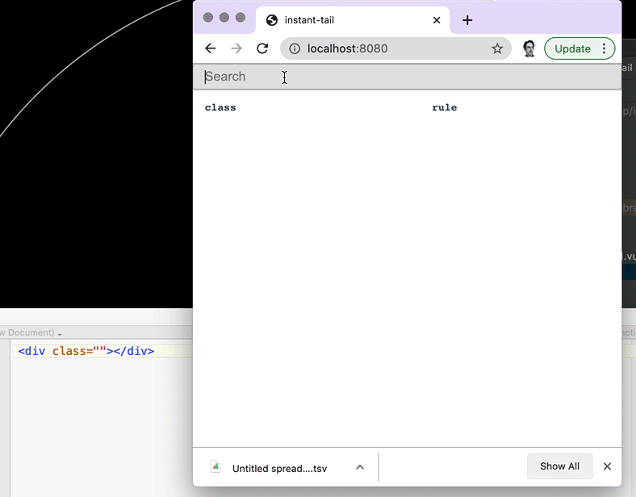

# Instant Tail

Local instant search for tailwind reference using Vue.js and 
Meilisearch. The goal was to allow for some semi-fuzzy search when I couldn't remember how a Tailwind class was structured.
So now just typing "text size" displays all of my options.   
This project will help you install Meilisearch on your local computer,
upload some indexed data of tailwind values and provide with a local Vue.js interface for instant search.  

When clicking on the **class** the tailwind valuse shown will be put in to your clipboard (tested with Chrome).


## Install Meilisearch
For this example I am using `brew` and the quick way to install is   
```brew update && brew install meilisearch```

However, there are a few other approached to install as well as documentation on their [GitHub Page](https://github.com/meilisearch/MeiliSearch).

## Configure indexes
From within the same directory as the `tailwind.json` file run the following:   
Create an index for tailwind.   
```curl -X POST 'http://127.0.0.1:7700/indexes'  --data '{"uid" : "tailcss"}'```

Upload the data.   
```curl -X POST 'http://127.0.0.1:7700/indexes/tailcss/documents' --data @tailwind.json```

To learn more about working with indexes visit [their documentation](https://docs.meilisearch.com/references/indexes.html#list-all-indexes).


## Build Setup


``` bash
# install dependencies
npm install

# serve with hot reload at localhost:8080
npm run dev

# build for production with minification
npm run build
```
Finally visit your website at   
```http://localhost:8080```

There are options for configuring the ports used differently to prevent conflict.
